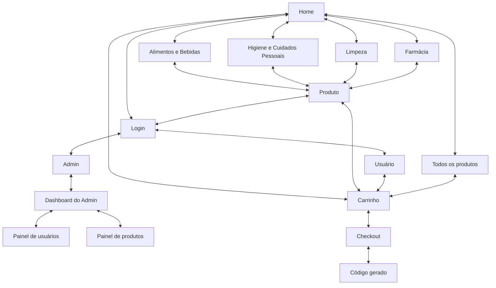

# 🛒 Projeto: Mercado de Condomínio - Near Market

### Grupo:
- João Pedro Alves Notari Godoy – NUSP: 14582076  
- Ayrton da Costa Ganem Filho – NUSP: 14560190  
- Pedro Louro Fernandes – NUSP: 13672446  

---

## 📌 1. Requisitos

### Usuários:
- **Clientes**: compram produtos
- **Administradores**: gerenciam produtos, clientes e outros admins

### Requisitos principais:
- Login (cliente/admin)
- Cadastro de produtos (nome, id, foto, descrição, preço, estoque, vendidos)
- Cadastro de clientes e admins (nome, id, email, telefone, endereço)
- Carrinho de compras (cliente escolhe produto, quantidade, compra com cartão (qualquer número aceito))
- CRUD de produtos (admin)
- Funcionalidade específica: Código de segurança gerado para a retirada dos produtos presencialmente

---

## 📝 2. Descrição do Projeto

O projeto será uma Single-Page Application (SPA) desenvolvida usando HTML5, CSS3 e JavaScript. Na primeira fase, desenvolvemos **mockups estáticos** para planejar o visual e a navegação do sistema.

### Funcionalidades planejadas:
- Tela inicial com login
- Tela de listagem de produtos para clientes
- Telas individuais para cada categoria de produto (Farmácia, Alimentos, etc)
- Tela administrativa para cadastro de produtos
- Tela de carrinho com os produtos selecionados pelos clientes
- Tela de pagamento e checkout dos produtos
- Navegação SPA simulada entre as telas

### Informações salvas no servidor (futuramente):
- Usuários (admin e clientes)
- Produtos (detalhes e estoque)
- Pedidos realizados

---

## 🧭 3. Diagrama de Navegação

---

## 💬 4. Comentários sobre o código

Sem código funcional no momento — apenas HTML/CSS estáticos.

---

## 🧪 5. Plano de Testes

Pretendemos usar Postman para testar o backend futuramente.  
Na fase atual, apenas validamos visualmente os elementos HTML/CSS.

---

## ✅ 6. Resultados dos Testes

Sem testes automatizados até o momento.

---

## 🛠 7. Procedimentos de Build

Para visualizar o projeto localmente:

1. Baixe o projeto.
2. Abra o arquivo `index.html` no navegador.
3. Use os links de navegação nas páginas para acessar as abas (somente Login, Carrinho e Página Inicial possuem abas finalizados).

---

## ⚠️ 8. Problemas

Nenhum problema encontrado até agora.

---

## 💡 9. Comentários

Estamos abertos a sugestões para melhorar o layout, acessibilidade e usabilidade das interfaces.

---

## 🔗 HTMLs Feitos

- [`index.html`](index.html): Tela inicial da loja, com principais produtos
- [`login.html`](login.html): Tela de login do usuário
- [`cart.html`](cart.html): Tela de carrinho para ver produtos escolhidos e finalizar a compra
