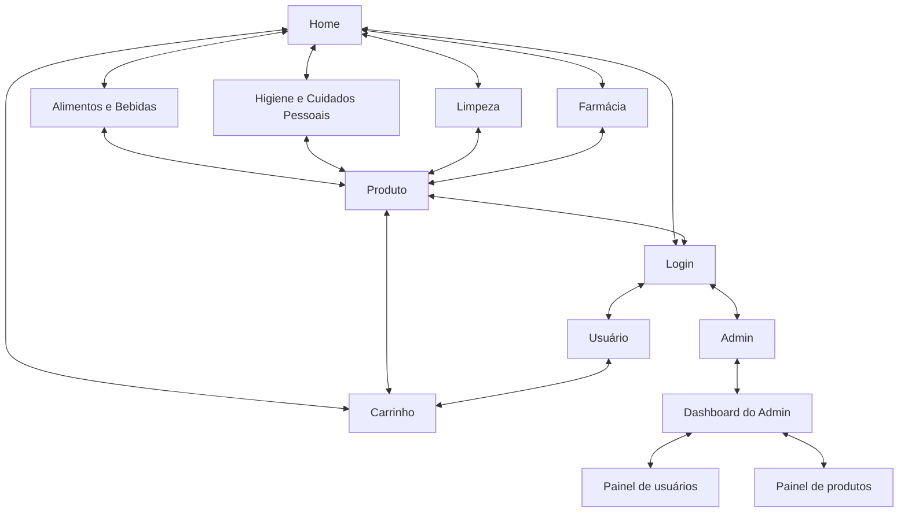

# 🛒 Projeto: Loja Online

### Grupo:
- João Pedro Alves Notari Godoy – NUSP: 14582076  
- Ayrton da Costa Ganem Filho – NUSP: 14560190  
- Pedro Louro Fernandes – NUSP: 13672446  

---

## 📌 1. Requisitos

### Usuários:
- **Clientes**: compram produtos.
- **Administradores**: gerenciam produtos, clientes e outros admins.

### Requisitos principais:
- Login (cliente/admin)
- Cadastro de produtos (nome, id, foto, descrição, preço, estoque, vendidos)
- Cadastro de clientes e admins (nome, id, email, telefone, endereço)
- Carrinho de compras (cliente escolhe produto, quantidade, compra com cartão (qualquer número aceito))
- CRUD de produtos (admin)
- Funcionalidade específica: [**exemplo**: "destaque da semana" com produtos promocionais]

---

## 📝 2. Descrição do Projeto

O projeto será uma Single-Page Application (SPA) desenvolvida usando HTML5, CSS3 e JavaScript. Na primeira fase, desenvolvemos **mockups estáticos** para planejar o visual e a navegação do sistema.

### Funcionalidades planejadas:
- Tela inicial com login
- Tela de listagem de produtos para clientes
- Tela administrativa para cadastro de produtos
- Navegação SPA simulada entre as telas

### Informações salvas no servidor (futuramente):
- Usuários (admin e clientes)
- Produtos (detalhes e estoque)
- Pedidos realizados

---

## 🧭 3. Diagrama de Navegação

```mermaid
graph TD
  Home[Home]
  Alimentos[Alimentos e Bebidas]
  Higiene[Higiene e Cuidados Pessoais]
  Limpeza[Limpeza]
  Farmacia[Farmácia]
  Produto[Produto]
  Carrinho[Carrinho]
  Login[Login]
  Usuario[Usuário]
  Admin[Admin]
  Dashboard[Dashboard do Admin]
  PainelUsuarios[Painel de usuários]
  PainelProdutos[Painel de produtos]

  %% Ligações
  Home <--> Alimentos
  Home <--> Higiene
  Home <--> Limpeza
  Home <--> Farmacia
  Home <--> Carrinho
  Home <--> Login

  Alimentos <--> Produto
  Higiene <--> Produto
  Limpeza <--> Produto
  Farmacia <--> Produto

  Produto <--> Carrinho
  Produto <--> Login

  Login <--> Usuario
  Usuario <--> Carrinho

  Login <--> Admin
  Admin <--> Dashboard

  Dashboard <--> PainelUsuarios
  Dashboard <--> PainelProdutos

  %% Links nos nós
  click Home "https://github.com/joaopgodoy/online_store_project/blob/main/mockups/index_01.png" _blank
  click Carrinho "https://github.com/joaopgodoy/online_store_project/blob/main/mockups/cart.png" _blank
  click Login "https://github.com/joaopgodoy/online_store_project/blob/main/mockups/login.png" _blank


```

---

## 💬 4. Comentários sobre o código

Sem código funcional no momento — apenas HTML/CSS estáticos.

---

## 🧪 5. Plano de Testes

Pretendemos usar Postman para testar o backend futuramente.  
Na fase atual, apenas validamos visualmente os elementos HTML/CSS.

---

## ✅ 6. Resultados dos Testes

Sem testes automatizados até o momento.

---

## 🛠 7. Procedimentos de Build

Para visualizar o projeto localmente:

1. Baixe o projeto.
2. Abra o arquivo `index.html` no navegador.
3. Use os links de navegação nas páginas para acessar os mockups.

---

## ⚠️ 8. Problemas

Nenhum problema encontrado até agora.

---

## 💡 9. Comentários

Estamos abertos a sugestões para melhorar o layout, acessibilidade e usabilidade das interfaces.

---

## 🔗 Mockups

- [`index.html`](index.html): Tela inicial da loja, com principais produtos
- [`login.html`](login.html): Tela de login do usuário
- [`cart.html`](cart.html): Tela de carrinho para ver produtos escolhidos e finalizar a compra